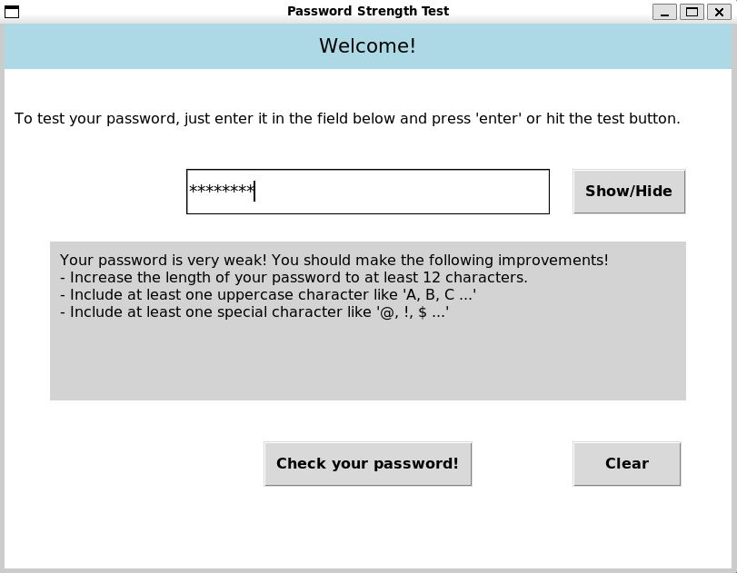
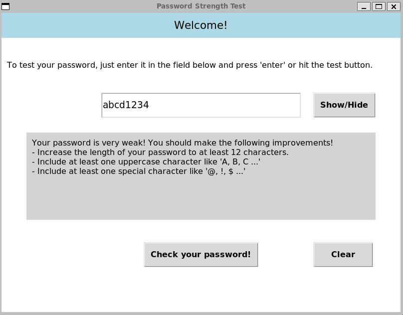

# password_test_GUI

## Table of Contents

1. [Introduction](#introduction)
2. [Installation](#installation)
3. [Structure](#structure)
4. [How to Use](#how-to-use)
5. [Examples](#examples)

## 1. Introduction <a name="introduction"></a>

`password_test_CLI` is a command-line interface (CLI) tool that allows users to test the strength of their passwords based on certain criteria. It provides feedback on the password's length, inclusion of numbers, uppercase and lowercase characters, and special characters.

## 2. Installation <a name="installation"></a>

### Option 1: Copy and Run

1. Copy the code into your own Python file (e.g., `main.py`).
2. Open a terminal.
3. Navigate to the directory containing your Python file.

### Option 2: Clone and Run

1. Clone the repository onto your machine with the following command:

    ```bash
    git clone https://github.com/bthee/password_test_CLI
    ```

2. Navigate into the cloned directory:

    ```bash
    cd password_test_CLI
    ```

## 3. Structure <a name="structure"></a>

The code is organized into the following functions:

`start()`: Asks the user to start or exit the program.\
`password_input()`: Prompts the user to input a password.\
`password_check(pw: str) -> tuple`: Checks the password strength and returns a tuple with Boolean values for the evaluation.\
`evaluation(checked_pw: tuple) -> None`: Prints password strength evaluation based on the tuple generated by password_check.\
`main() -> int`: The main function that orchestrates the flow of the program.

## 4. How to Use <a name="how-to-use"></a>

To run `password_test_CLI`, follow these steps:

1. Open a terminal.
2. Navigate to the directory containing the script.

    ```bash
    cd path/to/password_test_CLI
    ```

3. Run the script by executing:

    ```bash
    python password_test_CLI.py
    ```

4. Follow the prompts to either begin or exit the program.
5. If you choose to begin, input a password when prompted.
6. Receive feedback on the strength of your password based on specified criteria.

## 5. Examples <a name="examples"></a>



